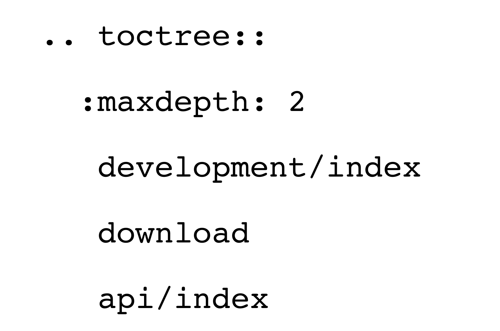

Good documentation answers this question. Bad documentation *elicits* this
question. Good software documentation is a software project-sized task unto
itself. The `MapServer`_ project has nearly fifteen years' worth of experience with
documenting a nearly 200k line software project with hundreds of features,
dozens of usage approaches, and tens of developers. We have learned a lot along
the way -- mostly through failure, and this presentation will describe what
makes a great documentation system for an open source software project, describe
the failures of the `MapServer`_ project, and tell about how we finally got going
on the right foot with `Sphinx`_, the software documentation management engine.

If code is the pickled knowledge of a problem domain, its documentation is at
least the cheeseburger

that goes with it. Good documentation is more than a condiment to a software
project, it's the main course. A user's primary interaction with a software
project is through the documentation, and when it fails, more users will
approach the project to start asking questions -- sometimes resource draining
FAQs -- sucking up developer resources that might otherwise be spent on code.
Like compounding interest, an investment in good documentation multiplies the
reach, effectiveness, and usefulness of software.

The `MapServer`_ project has gone through at least three, maybe four, major
documentation system transitions in its lifetime. These transitions were part of
a search to find a documentation system that balanced a number of needs.

The first property of a successful documentation system is straightforward
enough -- being easy to write docs with. Even though wrong documentation is
sometimes worse than no documentation, most of the time no documentation is a
project killer.  Who is using the documentation system to write docs is
important as well.  Are these all software developers? Power users? Newbies
contributing what little they can?  It's nearly impossible to satisfy all of
these audiences at once. The system must support the primary group of
documentation developers first.

A short diversion -- One might think that simply placing a wiki in front of the
project and having act as be the primary documentation system solves all of
your problems.  This is demonstrably false for a number of reasons.

First, if a wiki is like a garden, it only grows because it gets covered in
shit from time to time. Wikipedia has the advantage of scale that nearly every
open source software project doesn't have, and it has enough users to run along
and pull up all of the weeds that sprout up out of all that manure. One or two
dedicated wikiers, even with great impact, will eventually burn out, leaving
things to decay like the human civilization of Planet of the Apes. Your
project's wiki will then have more value to spammers for its Google juice than
it ever will to your users as primary documentation.

Second, while nature leads the way with evolving, self-organizing systems, a
software project's documentation on a wiki never seems to self organize. In the
face of continuing software versions, the documentation on a wiki is also apt
to get quickly out of date.  In addition to actual content, a major component
of software documentation is the curation that signals importants and order to
the readers. Wikis, while serendipitous, often lack the organization and all
items up with essentially equal importance without cues to for users to
discriminate.

So, back to easy. What makes something easy is that it works with documentation
writers existing workflow. For developers, this usually means text-only editing
with some sort of revision control system.  For power users, this might mean
something slightly different including IDEs and other GUIs. The principles
items that will make it easy to use for open source software developer-types
are simple markup and offline output generation.

Forcing writers into a constrained editing environment is going to cause
resentment and documentation-writing aversion. Forcing the to use an arcane and
poorly known documentation markup will cause authors to complain and look for
alternatives. Writers want tools to help hold their hands with the markup, if
available, or for the markup to stay out of the way if not.

Another successful property is good looking, multi-format output. Can I pull a
copy of your project's documentation down to a PDF file to carry with me on a
10 hour hack session/ squished-in-an-aluminum-tube-of-hell fight to Denver from
the EU? Can I read it on my fancy iPad, in tiny text on my Blackberry?
Multi-format output is important for *access*. The more access you can provide,
the more reach your documentation will have, and the more valuable the
documentation will be to the project.

Multi-format output also communicates professionalism to potential users of the
project. This is one area that an open source software project has the ability
to shine over commercial offerings -- documentation for many shrink-wrapped
software products is available in only one or two forms. By providing the
content in the format users demand, you make it easier for them to get work
done.

The best software documentation is organized to optimize how users interact with
the software and tracks the evolution of users from simple tasks to taking full
advantage of all the advanced features that exist within a software.  It tracks
the user as they move from larvae to catepillar to butterfly, and makes it easy
for users at each stage to find what they need.

This style of organization, however, is orthogonal to expert users of the
documentation. They need things orgnaized by major concept, with indexing and
search capabilities to help them take advantage of their already-engrained
knowledge of the software's jargon. Make sure that you have indexes, clear
table of contents, in-site search capability, and Google indexibility
to support non-linear access to the documentation.

Your project's documentation must attempt to service both of these aims.
Without new users, your software project will fail to thrive. Without power
users, your software project will fail to thrive. Organization of your project's
documentation is a crucial component in getting *it* to the butterfly room.

`MapServer`_'s first documentation effort was simple text/readme files alongside
the code and utilities. It was a poor fit because it didn't provide a website, a
way for people to search, multi-platform output, and lacked organization. Users
wanted more, and documentation writers wanted better representation of their
effort. After a short search, DocBook was found...

`MapServer`_'s second organized documentation system was built on DocBook. DocBook,
if you remember your internet history, is based on SGML, which is what Tim
Berners-Lee simplied into HTML because it was so insane and complicatied. While
it was theoretically possible for a user to get going writing documentation with
only CVS and a text editor with this system, users often chose to work inside
some sort of DocBook GUI that would do its best to shield them from the pain of
DocBook XML.

Documentation writers, including Jeff here, produced an excellent system of
documentation for `MapServer`_ with this system, in spite of its challenges. The
documentation was well-organized, with many sections related to specific
features and copious amounts of text describing details of how things worked.

The DocBook system was successful in a number of ways. First, there was lots of
documentation, and it was well-organized. Documentation writers could use their
existing editing tools, or adapt to new ones as they wished, to manage the
documentation in a CVS system.

The DocBook system was a huge hurdle for people to get started writing
documentation. Most, including developers such as myself, would not even bother
to learn DocBook XML, and would only make a few small edits when necessary. The
documentation lived in a separate CVS repository than the actual source code,
and this meant that the documentation had to be manually synchronized with
source releases. Finally, there was a vetting process that documentation writers
had to go through to be part of the documentation team. This added friction to
casual users looking to simply tweak a typo or add a paragraph adding their
hard-won knowledge on a particular subject.

Another challenge of the DocBook approach is there was no automated way to take
changes that were updated in CVS and turn them into HTML output for the website.
This lack of live-updating ability ended up being a giant hurdle and impetus for
the next `MapServer`_ documentation effort.

In the winter of 2003, I had been complaining loudly about the `MapServer`_
documentation system, and I embarked on re-implementing it within a Plone
content management system. Nearly two years later, the effort was complete and
all of the documentation was placed in Plone.

The Plone effort made it possible for anyone to sign up on the website to start
editing documentation directly through the web. It had some modicum of support
for multi-lingual documentation, and its output was much prettier and up-to-date
than the DocBook website. Another big and successful feature was the migration
of the majority of the content from DocBook XML to reStructured text. The
movement to reStructured text stripped away most of the markup that existed in
the documents, leaving mostly the text that writers cared about. The Plone
website, with its live updates, had searching ability, which gave users another
way to access content while being able to skip the artificial hierarchy that
existed. Another positive is that by the end of the effort, it even had support
for PDF output of individual document section.

The Plone effort failed in a number of ways, however. First, it violated the
rule of allowing the majority of document writers to manipulate content in
their existing tools -- our Plone system, due to lack of organizational Plone
programming prowess, required that users edit sections of the documents through
the web. This meant that developers were often copy-pasting content from their
existing editors into the website for upload. This lead to constant frustration
and complaints from the developers and documentation writers -- the very same
people the system was meant to serve.

The second significant failure of this system was the lack of versioning
ability. Again, our lack of programming prowess applied here, but the Plone
documentation product we were using didn't really have the ability to easily
synchronize the version of the document with the software version. Keeping
things in synch and knowing what was where started to become really difficult.
Did the website apply to the latest development version?  The latest released
version? Some mix of the two? These questions dogged the effort and really
started to hurt our effectiveness.

In the Fall of 2008, the US Army Corps of Engineers supported the development of
a new documentation system for `MapServer`_ based on the `Sphinx`_ documentation
system. `Sphinx`_ was developed by Georg Bandl for managing the documentation
effort of the Python project.  The Python project's documentation challenges are
much like `MapServer`_'s including versioning challenges, tons of content, many
authors, and the need for multi-platform output.

The movement to `Sphinx`_ had one built-in advantage that was carry-over from the
Plone effort -- the documents had already been converted to reStructured text.
With that in mind, I started laying out a `Sphinx`_-based text-only project to
manage the documentation.

`Sphinx`_ uses a couple of simple concepts to help you manage documentation as a
"system," rather than a simple set of disconnected documents. First is the idea
of "global references." It is possible to generate links from one document to
another with simple shorthands such as:

and create anchor tags in documents that these references can use with markup
such as

Additionally, headings and subheadings within documents are referenceable.  The
ease at which an author can link back to other pertenient documentation is
great, and this has meant more interlinking within the documentation.  This
interlinking is crucial to helping users bootstrap themselves with the project.
Each software project, in addition to developing functionality to do some task,
also has the challenge of educating its users about the jargon system that it
creates to describe those tasks. Interlinking in the documentation makes it
easier for users to get up to speed on this jargon.

The second important `Sphinx`_ concept is that of a Table of Contents.

A table of contents links to documents and inserts them with
their document titles in the TOC.

A `Sphinx`_ project is organized as a simple tree of directories, with a master
file that determines the Table of Contents for the entire project.  A
``Makefile`` (or makefile.bat in the case of Windows) is used to cause
generation of the directory index of reStructured text to be converted into PDF,
HTML, or one of the many other output formats that `Sphinx`_ supports.

`Sphinx`_ has been successful in a number of ways for the `MapServer`_ project.
First, it reconsiles the success of the DocBook effort, which was the ability
for developers and authors to continue to use the tools they are comfortable
with, with the Plone effort, which forced them into the editing-through-the-web
box.

Second, the `Sphinx`_ effort gave us tons of multi-platform output. PDF and HTML,
of course, but also fancy things like ePub and Windows Compiled Help files.  For
integrators that are embedding `MapServer`_ in other systems, these options are
wonderful.  They can easily take frozen snapshots of the documentation and move
it into their systems without worrying about synchronizing issues.

Third, we now have workable multi-lingual documentation. While multi-lingual
access wasn't available out-of-the-box with `Sphinx`_, Lars Lingner and others
were able to use the Makefile approach to put forward mutli-lingual versions of
documents that had been translated while leaving English-only versions for
those that had not. Multi-lingual content is a boon for the project, and we are
very happy for the effort that Lars has made to get this to happen. It has been
a dream of many for years.

The fourth big win for the project is we no longer have the requirement of
managing a complex, dynamic website built on a content management system.
Plone created a number of headaches for us including user/spam management,
system resource consumption, and maintenance and backup. With the `Sphinx`_
system, we now have a static website that is automatically updated via cron by
anyone who has commit access, and our backup is simply the source repositories
(and everyone else's local clones of that repository).

Statistics
~~~~~~~~~~~~~~~~~~~~~~~~~~~~~~~~~~~~~~~~~~~~~~~~~~~~~~~~~~~~~~~~~~~~~~~~~~~~~~~~

18 committers in doc group plus regular code committers
275 individual documents
864 pages when rendered in PDF

.. _`Sphinx`: http://sphinx.pocoo.org
.. _`MapServer`: http://mapserver.org
