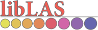
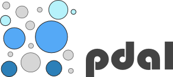
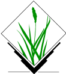

The State of Open Source LiDAR
==============================================================================

What is LiDAR
------------------------------------------------------------------------------

* Laser range finding
* Typically represented as "points"
* Not like raster
* Not like vector

.. s6:: effect slide

How does it behave?
------------------------------------------------------------------------------

* Big Data(TM)
* Redundant
* Irregular
* Multifaceted

.. s6:: effect slide

What to do?
------------------------------------------------------------------------------

* Exploit it
* Visualize it
* Filter it
* Transform it

.. s6:: effect slide

Exploitation
------------------------------------------------------------------------------

* Where is water going to flow?
* How much water is in this glacier?
* Where is the ground?
* Are these objects cars?

.. s6:: effect slide

Visualization
------------------------------------------------------------------------------

* Interactive 
* Static rendering
* Line of sight

.. s6:: effect slide

Filtering
------------------------------------------------------------------------------

* Attribute 
* Decimation
* Windowing
* Indexing

.. s6:: effect slide

Transformation
------------------------------------------------------------------------------

* Reprojection
* Attribute selection
* Statistics
* Format translation

.. s6:: effect slide

libLAS and LASlib
-------------------

* LASlib and libLAS
* Filtering and data access
* aka Shapefile or GeoTIFF

.. s6:: styles

    'div': {textAlign: 'right'},
    'div/img': {width: '100%', opacity: 0.2}

.. s6:: effect slide

LASzip
-------------------

* Differential encoding of point data
* 10:1+ 
* Sequential, with chunking

.. s6:: effect slide

PDAL
-------------------

* Translation pipelines
* Light filtering and algorithmic operations
* Abstract access to LiDAR data

.. s6:: styles

    'div': {textAlign: 'right'},
    'div/img': {width: '60%', opacity: 0.2},

.. s6:: effect slide

PCL
-------------------

* Filtering, feature estimation
* Surface reconstruction, registration
* Segmentation

.. figure:: figures/pointcloudlibrary_logo.png
    :scale: 100%
    :align: right

.. s6:: styles

    'div': {textAlign: 'right'},
    'div/img': {width: '60%', opacity: 0.2}

.. s6:: effect slide

3DTK
-------------------

* Similar to `PCL`_
* VTK-based toolbox of stuff
* Segmentation, registration ...

.. s6:: effect slide

GRASS
-------------------

* `libLAS <libLAS and LASlib>`_- or text- based import
* points ⇛raster
* tons of raster topograhy-oriented tools

    
.. s6:: effect slide

DielmoOpenLiDAR
-------------------

* gvSIG- based 
* Visualization, some manipulation

    
.. s6:: effect slide

points2grid
-------------------

* Simple interpolation
* Out-of-core support
* `PDAL`_ usage

.. s6:: effect slide

Opticks
-------------------

* ArcGIS-like interface
* DoD focus on remote sensing
* Grab bag of algorithms
* `OSGeo`_ Incubation application

.. _`OSGeo`: http://www.osgeo.org

.. s6:: effect slide

OSSIM
-------------------

* DoD focus on remote sensing
* LiDAR visualization with limited analysis 
* `OSGeo`_ project

.. _`OSGeo`: http://www.osgeo.org

.. s6:: effect slide

